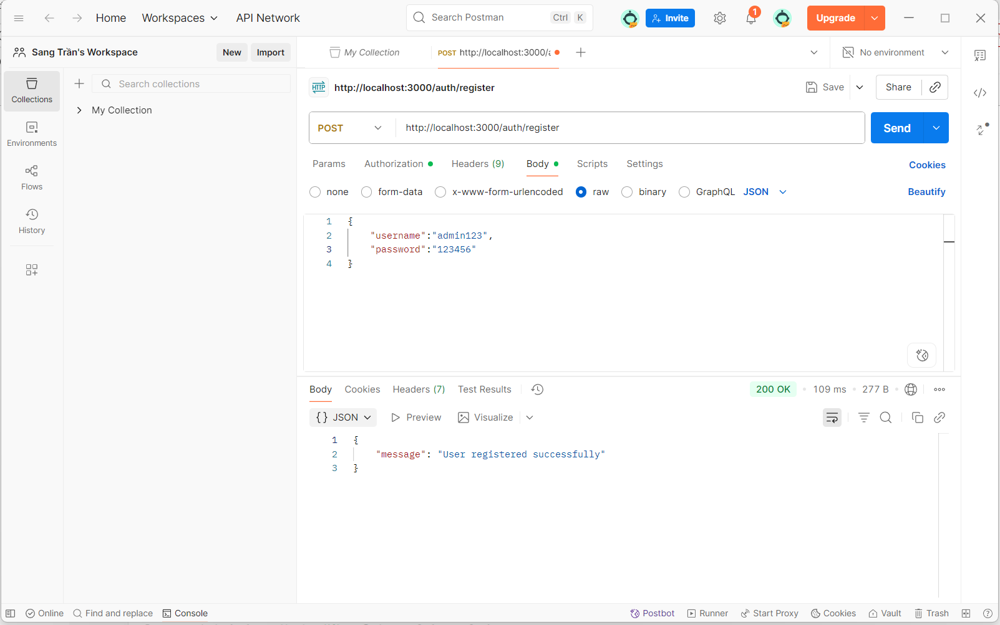
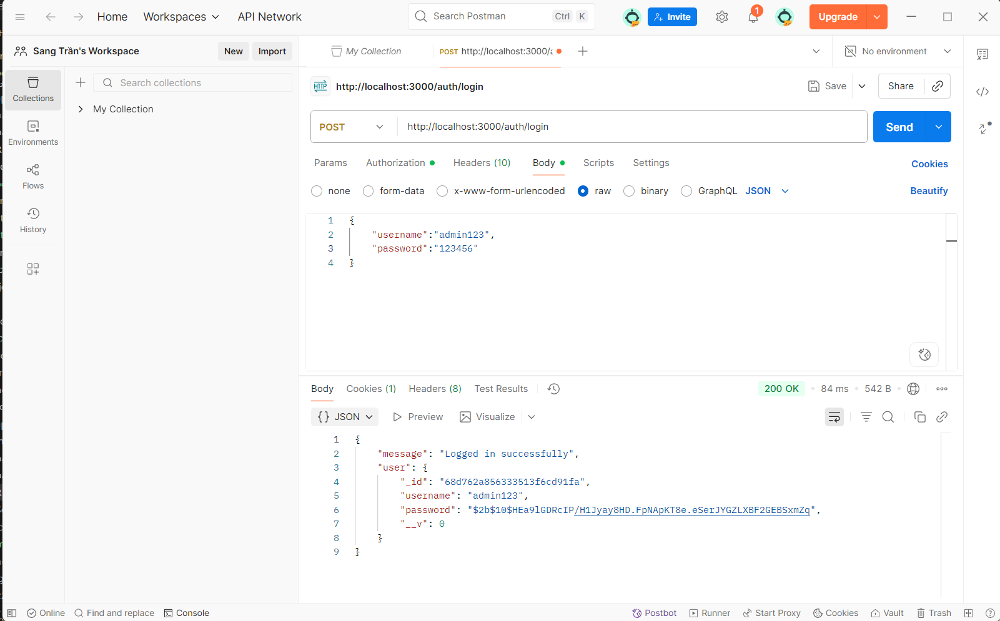
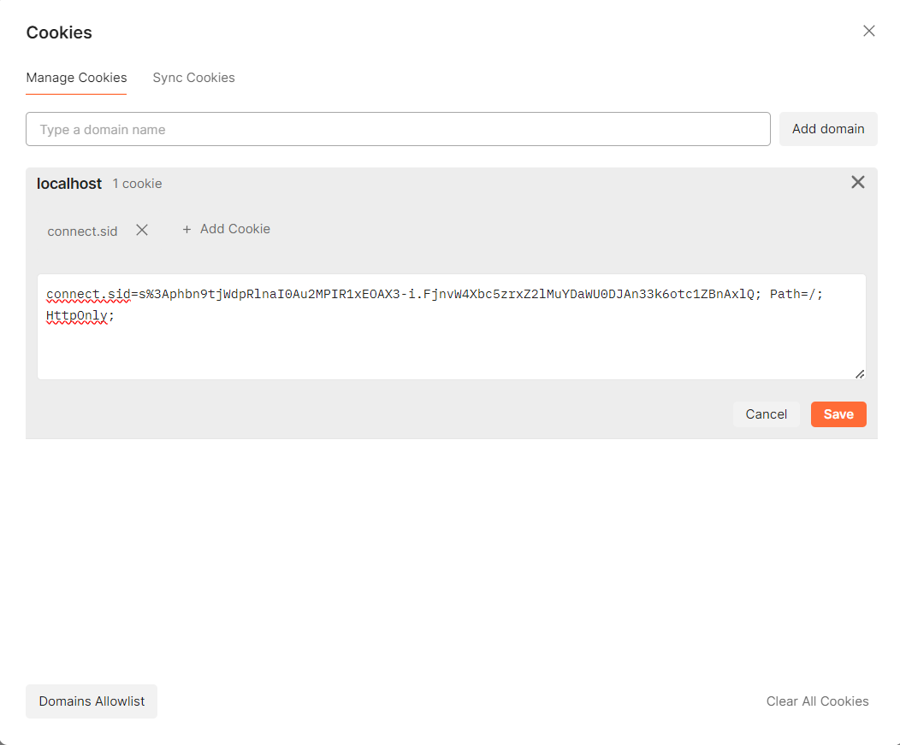

# Local Passport Authentication Service

Dự án này minh họa việc triển khai xác thực người dùng sử dụng Passport.js với Local Strategy trong Node.js và Express framework.

## Mô tả dự án

Local Passport Authentication Service sử dụng Passport.js Local Strategy để xác thực người dùng với username/password, lưu trữ thông tin user trong MongoDB và quản lý session với cookie.

## Kết quả Test API

### 1. Test đăng ký user (POST /auth/register)


**Mô tả**: 
- **Request**: POST `http://localhost:3000/auth/register`
- **Body**: JSON với `username: "admin123"` và `password: "123456"`
- **Response**: Status 200 OK với message "User registered successfully"
- **Chức năng**: API tạo tài khoản mới và lưu vào MongoDB với password được hash

### 2. Dữ liệu user trong MongoDB


**Mô tả**: 
- **User ID**: ObjectId được tạo tự động `68d762a856333513f6cd91fa`
- **Username**: "admin123" 
- **Password**: Đã được hash bằng bcrypt để bảo mật `$2b$10$HEa9lGDRcIP/HJlyayBHD.FpNApKT8e.eSer...`
- **__v**: Version key của MongoDB = 0
- **Database**: `passport_local_demo` collection `users`
- **Chức năng**: Password được mã hóa an toàn trước khi lưu vào database

### 3. Test đăng nhập (POST /auth/login)


**Mô tả**:
- **Request**: POST `http://localhost:3000/auth/login` 
- **Body**: JSON với `username: "admin123"` và `password: "123456"`
- **Response**: Status 200 OK với message "Logged in successfully!"
- **User Info**: Trả về thông tin user đã đăng nhập bao gồm `_id`, `username`, `password` hash
- **Chức năng**: Passport.js xác thực user và tạo session

### 4. Cookie session được tạo


**Mô tả**:
- **Cookie Name**: `connect.sid`
- **Cookie Value**: `s%3Aphbn9TjMdpRlnal0Au2MPIRixEDAX3-i.FjNvM4Xbc5zrxZ2lMuY0auU0DJAn33k6otc1ZBnAx1Q`
- **Path**: `/`
- **HttpOnly**: Được set để bảo mật
- **Chức năng**: Session cookie để duy trì trạng thái đăng nhập của user

## API Endpoints

### Đăng ký user
- **URL**: `POST /auth/register`
- **Body**: 
```json
{
  "username": "admin123", 
  "password": "123456"
}
```
- **Response**: `{"message": "User registered successfully"}`

### Đăng nhập
- **URL**: `POST /auth/login`
- **Body**:
```json
{
  "username": "admin123",
  "password": "123456" 
}
```
- **Response**: 
```json
{
  "message": "Logged in successfully!",
  "user": {
    "_id": "68d762a856333513f6cd91fa",
    "username": "admin123",
    "password": "$2b$10$HEa9lGDRcIP/HJlyayBHD.FpNApKT8e.eSer...",
    "__v": 0
  }
}
```

## Tính năng chính

- ✅ API đăng ký user mới với password hash
- ✅ API đăng nhập sử dụng Passport.js Local Strategy
- ✅ Hash password bằng bcrypt cho bảo mật
- ✅ Lưu trữ user trong MongoDB
- ✅ Quản lý session với express-session
- ✅ Cookie-based authentication
- ✅ Middleware xác thực Passport.js

## Công nghệ sử dụng

- **Node.js**: Runtime JavaScript
- **Express.js**: Web framework 
- **Passport.js**: Authentication middleware
- **passport-local**: Local authentication strategy
- **MongoDB**: NoSQL database
- **Mongoose**: MongoDB object modeling
- **bcrypt**: Hash password
- **express-session**: Session middleware
- **connect-mongo**: Store session trong MongoDB

## Cách chạy ứng dụng

```bash
# Cài đặt dependencies
npm install

# Chạy server
node app.js

# Truy cập ứng dụng
# http://localhost:3000
```

## Cấu trúc project

```
local_passport_auth_service/
├── app.js              # File chính của ứng dụng
├── package.json        # Dependencies và scripts
├── README.md          # Tài liệu dự án
├── models/            # Mongoose models
├── routes/            # API routes
└── images/            # Screenshots test
    ├── image.png      # MongoDB user data
    ├── Screenshot...  # Test đăng nhập
    ├── image-1.png    # Test đăng ký
    └── image-2.png    # Cookie session
```

## Luồng hoạt động

1. **Đăng ký**: Client gửi POST `/auth/register` → Server hash password với bcrypt → Lưu user vào MongoDB → Trả về success message
2. **Đăng nhập**: Client gửi POST `/auth/login` → Passport Local Strategy xác thực → So sánh password hash → Tạo session → Set cookie `connect.sid`
3. **Xác thực**: Client gửi request kèm session cookie → Passport deserialize user → Kiểm tra session hợp lệ → Cho phép truy cập

## Test với Postman

1. **Đăng ký user**:
   - Method: POST
   - URL: `http://localhost:3000/auth/register`
   - Headers: Content-Type: application/json
   - Body: `{"username": "admin123", "password": "123456"}`

2. **Đăng nhập**:
   - Method: POST  
   - URL: `http://localhost:3000/auth/login`
   - Headers: Content-Type: application/json
   - Body: `{"username": "admin123", "password": "123456"}`

3. **Kiểm tra Cookie**:
   - Sau khi đăng nhập thành công
   - Vào tab "Cookies" trong Postman
   - Xem cookie `connect.sid` đã được set

4. **Kiểm tra MongoDB**:
   - Mở MongoDB Compass
   - Kết nối đến `localhost:27017`
   - Kiểm tra database `passport_local_demo`
   - Xem collection `users` chứa user đã đăng ký

## Bảo mật

- Password được hash bằng bcrypt với salt rounds
- Session được lưu trữ an toàn trong MongoDB
- Cookie được cấu hình httpOnly để tránh XSS
- Passport.js cung cấp lớp bảo mật authentication
- User password không bao giờ được lưu dưới dạng plain text
