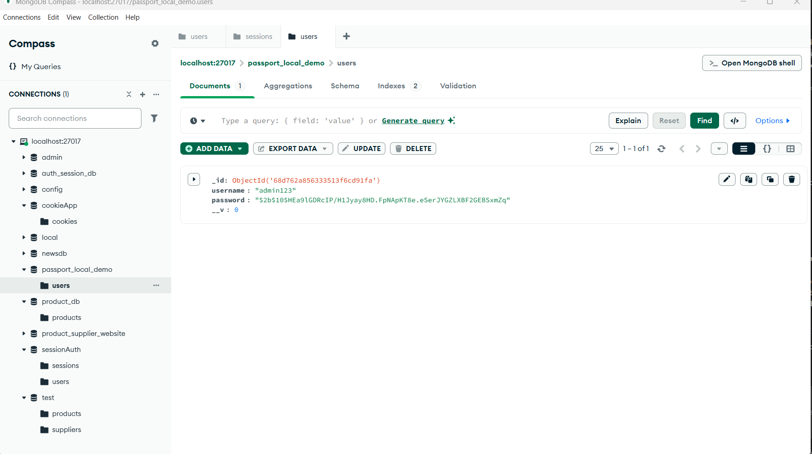

# Local Passport Authentication Service

Dự án này minh họa việc triển khai xác thực người dùng sử dụng **Passport.js Local Strategy** với MongoDB trong Node.js và Express framework.

## Mô tả dự án

Local Passport Authentication là phương pháp xác thực dựa trên username/password sử dụng thư viện Passport.js, một middleware xác thực phổ biến cho Node.js. Dự án sử dụng MongoDB để lưu trữ thông tin người dùng với password được mã hóa bằng bcrypt.

## Kết quả Test API

### 1. Dữ liệu User trong MongoDB


**Mô tả**: 
- **Database**: `passport_local_demo.users`
- **User ID**: ObjectId("68d762a856333513f6cd91fa")
- **Username**: "admin123" 
- **Password**: Đã được hash bằng bcrypt (`$2b$10$HEa9lGDRc1P/Ml3yayBHD.FpNApkT8e.eSer3YGZLXBf2GEB5xmZq`)
- **Chức năng**: Lưu trữ an toàn thông tin đăng nhập với password được mã hóa

### 2. Test đăng nhập thành công (POST /auth/login)


**Mô tả**:
- **Request**: POST `http://localhost:3000/auth/login`
- **Body**: JSON với `username: "admin123"` và `password: "123456"`
- **Response**: Status 200 OK với thông tin user đầy đủ
- **Dữ liệu trả về**: 
  - `message: "Logged in successfully"`
  - `user`: Object chứa thông tin user (id, username, password hash)
- **Session**: Cookie `connect.sid` được tạo để duy trì phiên đăng nhập

### 3. Quản lý Cookies trong Postman


**Mô tả**:
- **Cookie Name**: `connect.sid` 
- **Value**: Session ID được mã hóa (`s%3Aphbn9tJWdpRlnal0Au2MPIRlXEOAX3-i.FJnyM4XDc5zrxZ2lMuY0aqU0DJAn33k6otc1ZBnAx10`)
- **Domain**: `localhost`
- **Path**: `/`
- **HTTP Only**: Cookie được cấu hình an toàn
- **Chức năng**: Duy trì phiên đăng nhập giữa các request

### 4. Test đăng ký user mới (POST /auth/register) 


**Mô tả**:
- **Request**: POST `http://localhost:3000/auth/register`
- **Body**: JSON với `username: "admin123"` và `password: "123456"`
- **Response**: Status 200 OK với message "User registered successfully"
- **Chức năng**: Tạo tài khoản mới với password được hash trước khi lưu vào MongoDB

## API Endpoints

### Đăng ký user mới
- **URL**: `POST /auth/register`
- **Body**:
```json
{
  "username": "admin123",
  "password": "123456"
}
```
- **Response**: `{"message": "User registered successfully"}`

### Đăng nhập
- **URL**: `POST /auth/login`
- **Body**:
```json
{
  "username": "admin123", 
  "password": "123456"
}
```
- **Response**: 
```json
{
  "message": "Logged in successfully",
  "user": {
    "_id": "68d762a856333513f6cd91fa",
    "username": "admin123",
    "password": "$2b$10$HEa9lGDRc1P/Ml3yayBHD.FpNApkT8e.eSer3YGZLXBf2GEB5xmZq",
    "__v": 0
  }
}
```

### Đăng xuất
- **URL**: `POST /auth/logout`
- **Headers**: Cookie session từ request đăng nhập
- **Response**: `{"message": "Logout successful"}`

## Tính năng chính

- ✅ Đăng ký user với password hash (bcrypt)
- ✅ Đăng nhập bằng Passport.js Local Strategy  
- ✅ Quản lý session với express-session
- ✅ Lưu trữ user trong MongoDB
- ✅ Bảo vệ routes yêu cầu đăng nhập
- ✅ Cookie-based authentication
- ✅ Password security với bcrypt hashing

## Công nghệ sử dụng

- **Node.js**: Runtime JavaScript
- **Express.js**: Web framework
- **Passport.js**: Authentication middleware
- **passport-local**: Local authentication strategy
- **MongoDB**: NoSQL database 
- **Mongoose**: MongoDB object modeling
- **bcrypt**: Password hashing
- **express-session**: Session management
- **connect-mongo**: Store sessions in MongoDB

## Cách chạy ứng dụng

```bash
# Cài đặt dependencies
npm install

# Khởi động MongoDB service (nếu local)
mongod

# Chạy server
node app.js

# Truy cập ứng dụng
# http://localhost:3000
```

## Cấu trúc project

```
local_passport_auth_service/
├── app.js              # File chính với Passport config
├── package.json        # Dependencies và scripts  
├── README.md          # Tài liệu dự án
├── models/            # Mongoose models
│   └── User.js        # User model với bcrypt
├── routes/            # API routes
│   └── auth.js        # Authentication routes
├── config/            # Configuration files
│   └── passport.js    # Passport Local Strategy config
└── images/            # Screenshots test
    ├── image.png      # MongoDB users data
    ├── Screenshot 2025-09-27 110916.png  # Login success
    ├── image-1.png    # Cookie management
    └── image-2.png    # Register success
```

## Luồng hoạt động

1. **Đăng ký**: Client POST `/auth/register` → bcrypt hash password → Lưu user vào MongoDB → Response success
2. **Đăng nhập**: Client POST `/auth/login` → Passport xác thực → So sánh password hash → Tạo session → Set cookie
3. **Xác thực**: Client gửi request kèm cookie → Passport deserialize user → Kiểm tra session → Cho phép truy cập
4. **Đăng xuất**: Client POST `/auth/logout` → Destroy session → Clear cookie

## Test với Postman

### 1. Đăng ký user:
- Method: POST
- URL: `http://localhost:3000/auth/register`  
- Headers: `Content-Type: application/json`
- Body: `{"username": "admin123", "password": "123456"}`

### 2. Đăng nhập:
- Method: POST
- URL: `http://localhost:3000/auth/login`
- Headers: `Content-Type: application/json` 
- Body: `{"username": "admin123", "password": "123456"}`
- Result: Session cookie được tự động lưu

### 3. Kiểm tra Cookie:
- Vào Postman → Cookies → Xem `connect.sid`
- Cookie sẽ được gửi tự động trong các request tiếp theo

### 4. Test routes được bảo vệ:
- Method: GET
- URL: `http://localhost:3000/profile` (protected route)
- Cookie session sẽ được gửi tự động

## Bảo mật

- **Password Hashing**: Sử dụng bcrypt với salt rounds 10
- **Session Security**: HttpOnly cookies, secure flags
- **Input Validation**: Validate username và password
- **CSRF Protection**: Có thể thêm csrf middleware
- **Rate Limiting**: Có thể thêm rate limiting cho login attempts

## Passport.js Local Strategy

```javascript
passport.use(new LocalStrategy(
  async (username, password, done) => {
    try {
      const user = await User.findOne({ username });
      if (!user) return done(null, false);
      
      const isMatch = await bcrypt.compare(password, user.password);
      if (!isMatch) return done(null, false);
      
      return done(null, user);
    } catch (error) {
      return done(error);
    }
  }
));
```

## Lưu ý

- Đảm bảo MongoDB đang chạy trước khi start server
- Session sẽ được lưu trong MongoDB collection `sessions`
- Cookie có thể được cấu hình thêm secure, sameSite cho production
- Nên thêm validation middleware cho input sanitization
